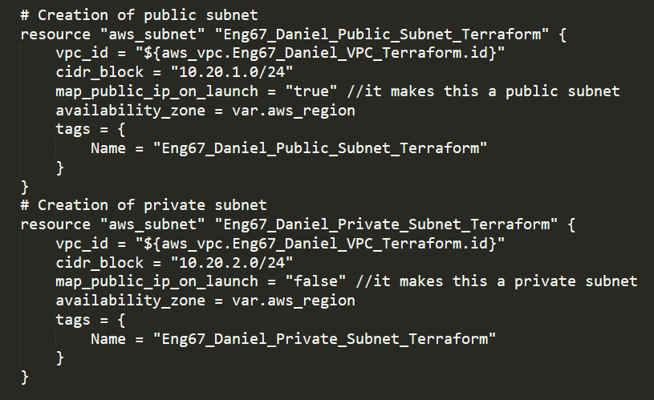
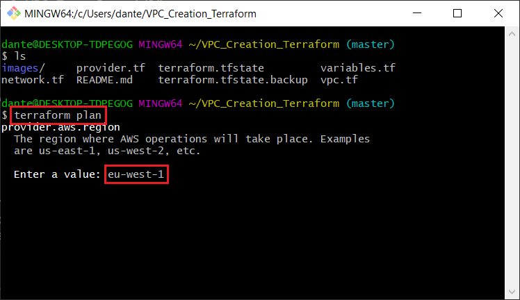
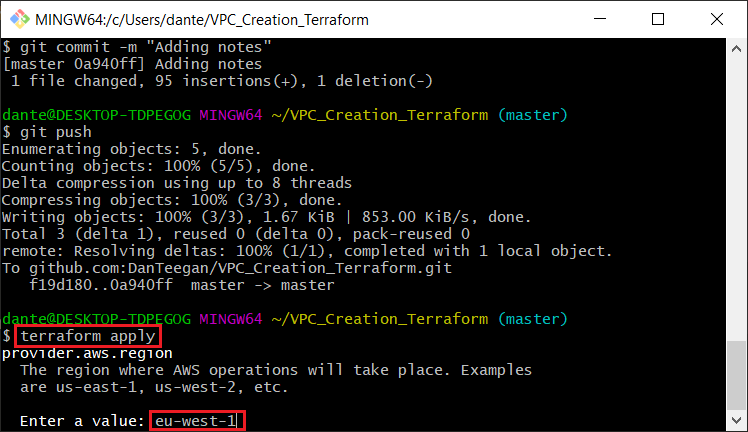
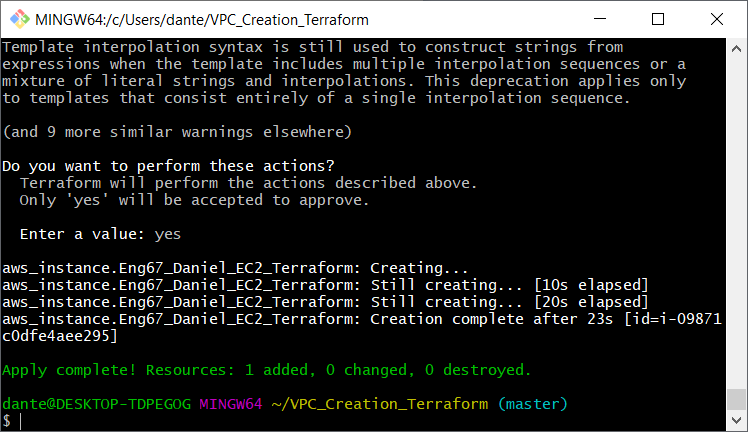
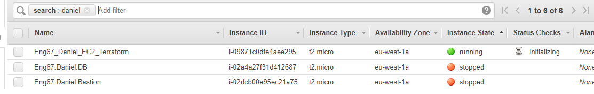
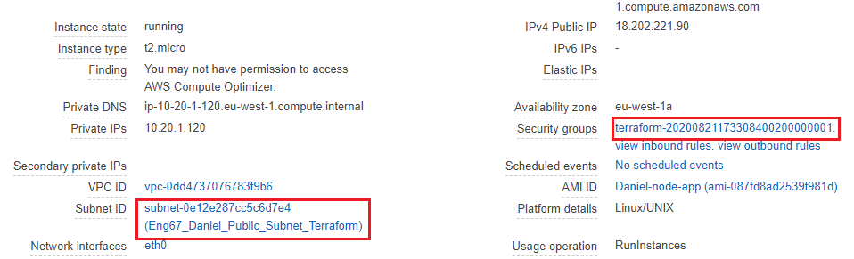

# Using Terraform to create a VPC

##### This project will showcase IaC orchestration tools to create infrastructure on the AWS cloud. It will showcase the power of tools such as Terraform can be in creating infrastructure, more specifically a VPC network on AWS.

# Creating a VPC using IAC Terraform

##### 1) First things first lets create the following files:
- vpc.tf
- variables.tf
- network.tf
- provider.tf


##### 2) Now we can initialize terraform using the command terraform init
``` terraform init ```


##### 3) Now we can enter the variables.tr file. Here we will be setting all the variables needed to create the VPC
``` variable "aws_region" {  
    default = "eu-west-1a"
}

variable "app_ami_id" {
    type = string
    default = "ami-087fd8ad2539f981d"
    }

```


##### 4) Now we can go inside the provider.tf file and add in our provider. We will be using AWS.
```
provider "aws" {
    region = var.aws_region
}
```


##### 5) Now go inside your vpc.tf file. Add the code to create the VPC:
```
resource "aws_vpc" "Eng67_Daniel_VPC_Terraform" {
    cidr_block = "10.20.0.0/16"
    enable_dns_support = "true" #gives you an internal domain name
    enable_dns_hostnames = "true" #gives you an internal host name
    enable_classiclink = "false"
    instance_tenancy = "default"     
}
```
##### 6) Now in the same file we can create the public and private subnets. The code for this is below, Remember to change the cidr block of the subnets:



```
# Creation of public subnet 
resource "aws_subnet" "Eng67_Daniel_Public_Subnet_Terraform" {
    vpc_id = "${aws_vpc.Eng67_Daniel_VPC_Terraform.id}"
    cidr_block = "10.20.1.0/24"
    map_public_ip_on_launch = "true" //it makes this a public subnet
    availability_zone = var.aws_region
    tags = {
        Name = "Eng67_Daniel_Public_Subnet_Terraform"
    }
}
# Creation of private subnet 
resource "aws_subnet" "Eng67_Daniel_Private_Subnet_Terraform" {
    vpc_id = "${aws_vpc.Eng67_Daniel_VPC_Terraform.id}"
    cidr_block = "10.20.2.0/24"
    map_public_ip_on_launch = "false" //it makes this a private subnet
    availability_zone = var.aws_region
    tags = {
        Name = "Eng67_Daniel_Private_Subnet_Terraform"
    }
}
```

##### 7) Now inside the network.tf file we want to create an internet gateway. The code is as folllows:
```
# Creating an internet gateway
resource "aws_internet_gateway" "Eng67_Daniel_IGW_Terraform" {
    vpc_id = "${aws_vpc.Eng67_Daniel_VPC_Terraform.id}"
    tags = {
        Name = "Eng67_Daniel_IGW_Terraform"
    }
}
```

##### 8) Now we can move on to creating the route table. Agin this is done in the network.tf file
```
resource "aws_route_table" "Eng67_Daniel_RouteTable_Terraform" {
    vpc_id = "${aws_vpc.Eng67_Daniel_VPC_Terraform.id}"
    route {
        //associated subnet can reach everywhere
        cidr_block = "0.0.0.0/0" 
        //CRT uses this IGW to reach internet
        gateway_id = "${aws_internet_gateway.Eng67_Daniel_IGW_Terraform.id}" 
    }
    tags = {
        Name = "Eng67_Daniel_RouteTable_Terraform"
    }
}
```

##### 9) Now we must create a link between the subnet and the route table. Agin this is done in the network.tf file
```
resource "aws_route_table_association" "Eng67_Daniel_Subnetlink_Terraform"{
    subnet_id = "${aws_subnet.Eng67_Daniel_Public_Subnet_Terraform.id}"
    route_table_id = "${aws_route_table.Eng67_Daniel_RouteTable_Terraform.id}"
}
```

##### 10) Now we create the security group. We need to allow an ssh connection from your personal on prem system and also open port 80 to everybody
```
resource "aws_security_group" "Eng67_Daniel_SG_Terraform" {
    vpc_id = "${aws_vpc.Eng67_Daniel_VPC_Terraform.id}"
    
    egress {
        from_port = 0
        to_port = 0
        protocol = -1
        cidr_blocks = ["0.0.0.0/0"]
    }
    ingress {
        from_port = 22
        to_port = 22
        protocol = "tcp"
        // This means, all ip address are allowed to ssh ! 
        // Do not do it in the production. 
        // Put your office or home address in it!
        cidr_blocks = ["92.234.30.225/32"]
    }
    //If you do not add this rule, you can not reach the NGIX  
    ingress {
        from_port = 80
        to_port = 80
        protocol = "tcp"
        cidr_blocks = ["0.0.0.0/0"]
    }
    tags = {
        Name = "Eng67_Daniel_SG_Terraform"
    }
}
```

##### 11) Almost there! now we just need to add in our EC2 block code creation. This is done in the vpc.tf file.
```
resource "aws_security_group" "Eng67_Daniel_SG_Terraform" {
    vpc_id = "${aws_vpc.Eng67_Daniel_VPC_Terraform.id}"
    
    egress {
        from_port = 0
        to_port = 0
        protocol = -1
        cidr_blocks = ["0.0.0.0/0"]
    }
    ingress {
        from_port = 22
        to_port = 22
        protocol = "tcp"
        // This means, all ip address are allowed to ssh ! 
        // Do not do it in the production. 
        // Put your office or home address in it!
        cidr_blocks = ["92.234.30.225/32"]
    }
    //If you do not add this rule, you can not reach the NGIX  
    ingress {
        from_port = 80
        to_port = 80
        protocol = "tcp"
        cidr_blocks = ["0.0.0.0/0"]
    }
    tags = {
        Name = "Eng67_Daniel_SG_Terraform"
    }
}
```

##### 12) Now all thats left to do is run the command ```terraform plan  ``` If you are prompted to enter a region enter ```eu-west-1 ```



##### 13) If no errors occur we can then run ```terraform apply``` again If you are prompted to enter a region enter ```eu-west-1 ```



##### 14) If successfull you should see a similar screen



##### 15) As we can see on AWS the instance has been created



##### 15) And we have the configurations that we used in the terraform file


