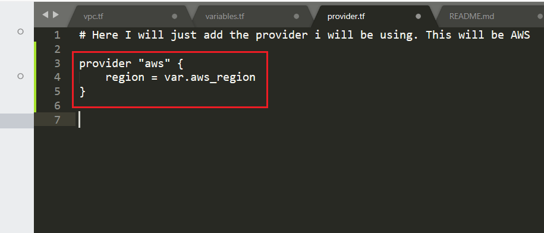

# Creating a VPC using IAC Terraform

##### 1) First things first lets create the following files:
- vpc.tf
- variables.tf
- network.tf
- provider.tf


##### 2) Now we can initialize terraform using the command terraform init
``` terraform init ```


##### 3) Now we can enter the variables.tr file. Here we will be setting all the variables needed to create the VPC
``` variable "aws_region" {  
    default = "eu-west-1a"
}

variable "app_ami_id" {
    type = string
    default = "ami-087fd8ad2539f981d"
    }

```


##### 4) Now we can go inside the provider.tf file and add in our provider. We will be using AWS.
```
provider "aws" {
    region = var.aws_region
}
```



##### 5) Now go inside your vpc.tf file. Add the code to create the VPC:
```
resource "aws_vpc" "Eng67_Daniel_VPC_Terraform" {
    cidr_block = "10.20.0.0/16"
    enable_dns_support = "true" #gives you an internal domain name
    enable_dns_hostnames = "true" #gives you an internal host name
    enable_classiclink = "false"
    instance_tenancy = "default"     
}
```
##### 6) Now in the same file we can create the public and private subnets. The code for this is below, Remember to change the cidr block of the subnets:

```
# Creation of public subnet 
resource "aws_subnet" "Eng67_Daniel_Public_Subnet_Terraform" {
    vpc_id = "${aws_vpc.Eng67_Daniel_VPC_Terraform.id}"
    cidr_block = "10.20.1.0/24"
    map_public_ip_on_launch = "true" //it makes this a public subnet
    availability_zone = var.aws_region
    tags = {
        Name = "Eng67_Daniel_Public_Subnet_Terraform"
    }
}
# Creation of private subnet 
resource "aws_subnet" "Eng67_Daniel_Private_Subnet_Terraform" {
    vpc_id = "${aws_vpc.Eng67_Daniel_VPC_Terraform.id}"
    cidr_block = "10.20.2.0/24"
    map_public_ip_on_launch = "false" //it makes this a private subnet
    availability_zone = var.aws_region
    tags = {
        Name = "Eng67_Daniel_Private_Subnet_Terraform"
    }
}
```

##### 7) Now inside the network.tf file we want to create an internet gateway. The code is as folllows:
```
# Creating an internet gateway
resource "aws_internet_gateway" "Eng67_Daniel_IGW_Terraform" {
    vpc_id = "${aws_vpc.Eng67_Daniel_VPC_Terraform.id}"
    tags = {
        Name = "Eng67_Daniel_IGW_Terraform"
    }
}
```

##### 8)